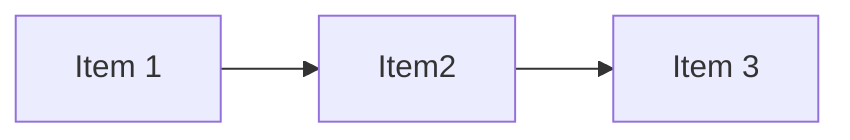

# Arrays e Listas encadeadas

### Arrays
O conceito de array apresentado no livro eh o mesmo de sempre, temos uma sequencia de memoria que determinamos o tamanho e usamos ela para guardar nossos elementos. Caso essa lista precise de mais espaco sera necessario encontrar um ponto de memoria que acomode o(s) novo(s) itens e transferir todo mundo do espaco de memoria A para o B.

Por conta do comportamento descrito no paragrafo anterior podemos concluir que mudar todo mundo de lugar eh uma operacao custosa e por isso **adicionar novos itens em um array eh uma tarefa devagar**

### Listas encadeadas
Em suma, esse tipo de estrutura armazena o valor atual + o endereco do proximo item do array, literalmente uma estrutura comeca a apontar para a outra. Por conta disso, eh possivel adicionar um item ao final da lista sem muitos problemas tendo em vista que como so ocorre apontamentos ninguem precisara ser transferido apenas o ultimo item sera atualizado para saber onde seu sucessor esta

Como as listas encadeadas dependem de interligacao, nelas **nao eh possivel pular diretamente para o elemento que desejamos** (Item 3 por exemplo). Temos que passar item a item ate encontrarmos o que gostariamos de visualizar.

Esse tipo de estrutra pode ser interessante caso quisessemos ler cada um dos itens individualmente ate o final. Outro ponto que ela tambem se destaca seria na insercao/delecao de itens na lista pois nao importa o local a unica coisa que precisara ser feito eh adicionar a tarefa e atualizar o ponteiro do item anterior.

## Acesso aleatorio X Acesso sequencial
Aleatorio = Acessa um elemento qualquer apenas indicando o numero
Sequencial = Deve acessar todos os elementos anteriores para so depois acessar o elemento desejado

# Ordenador por selecao
Imagine que voce possui um array com os dados da quantidade de vezes que cada em pessoa de sao paulo dirigiu um carro durante o ano. Tendo posse dessa info, gostariamos de organizar em um ranking as 10 pessoas que mais dirigiram no ano passado.

Se resolvermos esse problema com "Ordenador por selecao", basicamente teriamos o seguinte fluxo:

    1. Escaneie a lista inteira e pegue o motorista com maior valor
    2. Adicione esse motorista no ranking
    3. Escaneie toda a lista novamente (excluindo o motorista anterior colocado no ranking)
    4. Repita o passo 3 ate preencher completamente o ranking

Como eh possivel perceber, esse algoritmo acaba sendo muito custoso, pois sempre vamos escanear a lista varias vezes (O(n^2))
