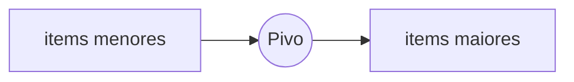

# Dividir para conquistar
Conceitualmente isso eh uma ideia de como se pensar sobre um problema e nao um algoritmo em si. A estrategia seria dividir o problema, ate chegarmos na menor parte possivel, apos encontrar a menor parte possivel (caso base), conseguimos resolver todo o problema.

Um exemplo que o autor apresenta em seu livro eh o seguinte: *Um fazendeiro detem um terreno de 1680x640. Qual o maior quadrado possivel que podemos gerar para dividir igualmente esse terreno?*

De fato, estamos falando de uma area muito grande para atuarmos, entao a ideia eh a seguinte:
    
    1. Divida o terreno atual de forma a criar o maximo de quadrados possiveis
    2. Verifique se eh possivel dividir internamente o terreno
    3. Se o caso 2 for verdade, execute a instrucao 1 novamente

Perceba que de forma escrita acabamos de descrever uma recursao. Havera uma hora em que o caso 2 sera falso essa sera nossa condicao de parada (ou nas palavras do autor *caso base*)

O conceito descrito acima pode ser encontrado nos seguintes arquivos:

    - Capitulo 4/somatoria_array/main.cpp
    - Capitulo 4/encontrar_valor_mais_alto/main.cpp
    - Capitulo 4/contagem_items_array/main.cpp

# Quicksort
*Algoritmo de ordenacao que se utiliza da tatica "Dividir para conquistar"*

Como utilizamos a estrategia de dividir para conquistar, se faz necessario que a gente divida o array (nao me diga). Quando dividimos o array, pegamos na realidade 1 unico elemento dele, damos o nome desse pedaco destacado de **Pivô**. Devemos entao comecar a comparar o pivo contra os item do array, passando todos os menores para tras do pivo e deixando o pivo atras dos numeros maiores (caso exista).

**Particionamento:** esse nome eh dado quando quebramos um array em pedacos menores e utilizamos a propria parte destacada contra o proprio array.

Com o array particionado temos as sequintes partes:

    1. Um sub-array menor que o pivo
    2. Pivo
    3. um sub-array maior que o pivo

### Provas por inducao
No livro para ensinar sobre o quicksort o autor acaba passando pro uma estrategia de "prova real" chamada "prova por inducao". Ela tem o que eh chamado de caso base e caso indutivo (bem similar ao conceito de recursao). Eles significam o seguinte:

> Caso base = Condicao que faz com que eu execute o primeiro passo da minha atividade (Como estamos falando sobre recursao acaba sendo um pouco confuso pois o primeiro passo da minha atividade pode tambem significar o ultimo caso de recursao)

> Caso indutivo = Se meu caso base nao foi alcancado, teste novamente o metodo porem agora passando um valor diferente do inicial

Vamos falar em um exemplo para facilitar. 
*Como eu posso provar que posso subir uma escada?*
Bem, eu devo primeiro colocar um dos meus pes na escada (**Caso base**)
Depois, devo colocar meu pe oposto no bloco superior ao meu primeiro pe (**Caso indutivo**)

Repare que nesse exemplo, se eu seguir a logica em loop (ou melhor dizendo, em recursao), rapidamente conseguirei subir a escada.

**Essa estrategia pode ser muito interessante na hora de construir algoritmos, principalmente comecando pelo basico e ir construindo de forma solida as outras variacoes.**