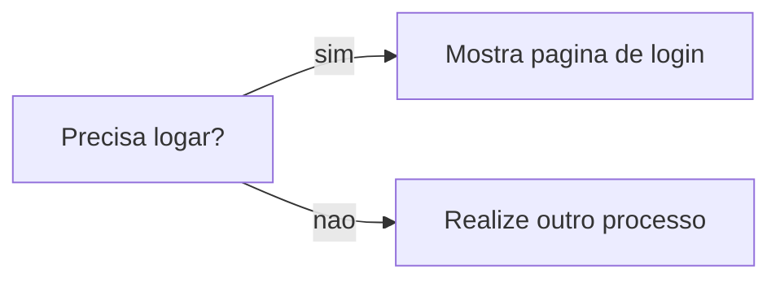

# Funcoes Hash
Sao funcoes que funcionam como um dicionario (Python) ou um HashMap (Java). A ideia por tras dela eh simples, voce procura na estrutura de dados por um termo X e ele te retorna o valor Y.

O tempo de acesse para qualquer um dos itens eh sempre o mesmo O(1)

## Utilizacao
Um exemplo de caso de uso de tabela hash, eh qualquer cenario onde voce tenha 2 tipos de dados relacionados. Uma agenda telefonica (nome<->numero), nota de um aluno (aluno<->nota), nome do site e seu ip (site<->ip), etc.

*Muito provavelmente a tecnologia que o DNS utiliza para pesquisas seja tabela hash pois sua velocidade eh constante e a base de dados enorme*

Outro ponto que as tabelas hash sao uteis eh na criacao de cache. Em suma funciona da seguinte maneira.

Quando voce acessa o Facebook e esta deslogado, o servidor precisaria reconhecer isso, depois processar a nova pagina de login e ai entao voce veria a pagina. Com o caching, o fluxo ocorre em velocidade constante da seguinte forma:

### Colisoes
Colisao eh o ato de fazer 2 chaves apontarem para o mesmo espaco. Eh como se a gente pegasse um array, e fizesse dois ponteiros apontarem para o mesmo espaco da memoria. O ato de evitar colisoes que faz o map ser mais ou menos performatico.

### Desempenho
Como descrevi anteriormente, as colisoes estao diretamente ligadas ao desempenho da tabela. Pelo que o autor da a enter em sua obra, um hash ele nada mais eh do que uma variacao de array(que ao inves de usar index usa um nome pra se localizar). Essa descricao eh importante para o cenario que irei passar agora.

Quando temos um hash eh como se tivessemos um array de tamanho fixo (5 espacos por exemplo). Ao comecar preencher o hash estamos tambem preenchendo o array.

Havera uma hora em que nossa quantidade de itens sera igual ao tamanho do array. E agora?

Agora precisamos expandir o array (digamos que 2X o tamanho inicial, ou seja no nosso exemplo 10). E depois de expandirmos agora sim temos como trabalhar naquele array novamente.

A situacao que eu acabei de descrever de fato acontece no hash mas o nome bonito que eh dado para esse caso eh **Fator de carga**.

O fator de carga eh calculado por: qtd itens / tamanho
se esse fator de carga for >= 0.7 eh recomendavel expandir o hash