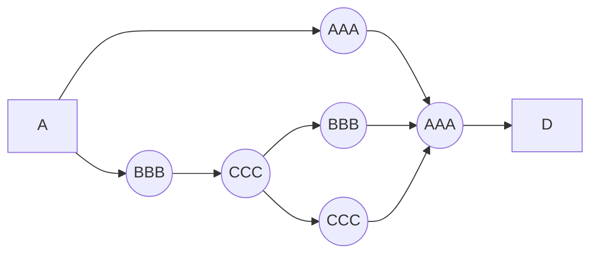
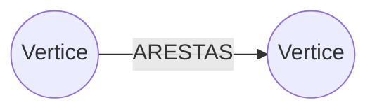
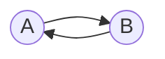

# Pesquisa em Largura (breadth-first search BFS)

Vamos imaginar a possibilidade de sairmos do ponto A e chegarmos ao ponto D no modelo abaixo:

Por mais que pareca confuso, eh possivel identificar que se irmos pelo caminho "AAA" encontraremos o **Caminho minimo** (Termo utilizado para descrever com quantos passos chegamos no nosso destino).

*Quantos passos devemos andar para chegarmos no ponto D?*
Essa pergunta o proprio caminho minimo responde, precisamos de 3 passos, sao eles:

1. A -> AAA
2. AAA -> AAA
3. AAA -> D

O algoritmo que calcula essa resposta para nos eh conhecido como "Pesquisa em Largura".

O algoritmo busca responder 2 perguntas principais

1. Existe um caminho do ponto A ate o ponto B?
2. Qual caminho minimo do ponto A ate o ponto B?

**Redes sociais**
A pesquisa em largura sempre da preferencia por encontrar o caminho mais proximo, vamos supor que voce esta no LinkedIn e deseja encontrar um emprego. Voce pode ir na opcao de listagem e verificar que voce tem como pesquisar por conexoes sua de primeiro, segundo e terceiro grau.

Quando usamos o algoritmo de pesquisa em largura, ele tentara buscar primeiro por suas conexoes de primeiro grau, se nao tiver ele vai para a de 2 e assim por diante

Justamente por seguir esse modelo que encontramos o caminho mais curto, ja que nao teremos nada de niveis mais profundos adicionados as opcoes de pesquisa enquanto nao validarmos todas as opcoes do nivel atual.

Para ajudar a seguir essa ordem temos as **Filas**

## O que sao grafos?
R: Um conjunto de conexoes

A estrutura de um grafo se assemelha a apresentada abaixo:

Vertices diretamente conectados uns aos outros sao chamados de **vizinhos**

Relacoes que acontecem apenas em um sentido sao chamadas de **Digrafos (ou grafo direcionado)**

Grafos nao direcionados (ou somente grafos) eh o nome da estrutura que aponta para seu vizinho e ele aponta de volta para voce. Da forma abaixo:

*Eh normal que grafos nao direcionados sejam escritos sem setas, como estou usando markdown elas acabam aparecendo*

### Filas
O conceito de fila obedece exatamente o que temos no mundo real. Supondo que voce chegou em uma loja e deseja comprar um item no caixa, voce pega a fila e espera chegar a sua vez ate ser atendido.

As filas possuem apenas 2 processos possiveis, sao eles:
    
    - Enqueue: Enfileirar (Adiciona itens)
    - Dequeue: Desenfileirar (Remove itens)
    
As filas obedecem o padrao FIFO (First In, First Out)