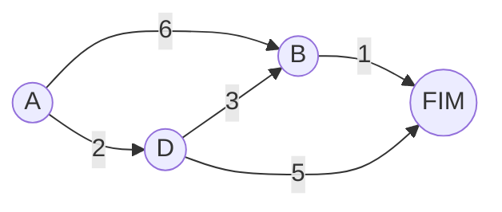

# Algoritmo de Dijkstra

Seguimos com a ideia de grafos apresentada no capitulo 6 porem agora com um incremento. E se estivermos querendo chegar do ponto A ao ponto B no menor **tempo** possivel? Nao necessariamente o menor caminho eh o caminho mais rapido (pode estar com transito no trajeto por exemplo). Para calcularmos o ponto mais rapido utilizamos o algoritmo de Dijkstra.

Assim como o algortmo de "pesquisa em largura", temos algumas etapas para seguir em nosso algoritmo. Sao elas:

1. Encontre o vertice que seja mais rapido para chegar
2. Atualize o custo dos vizinhos
3. Repita ate cobrir todos os vertices do grafo
4. Calcule o tempo final

> O algoritmo nao funciona com pesos negativos, ele acaba se perdendo e nao escolhendo o caminho mais curto.

### Etapa 1
Devemos identificar qual ponto mais rapido de se chegar no nosso grafo
Olhando para o desenho acima podemos identificar que A->D leva apenas 2 minutos enquanto A->B leva 6. Logo, A->B eh nosso ponto mais rapido.

Por conta dessa descoberta, nossa tabela de tempo ficara assim:

|Vertice |Tempo    |
|--------|---------|
|D       |2        |
|B       |6        |
|FIM     |INFINITO |

### Etapa 2
Agora que conhecemos o ponto mais proximo da gente, hora de realizar esse passo novamente, agora para encontrar o ponto mais proximo entre os vertices vizinhos

Considerando que estamos no ponto D temos 2 opcoes.

1. Ou vamos para o final com um caminho de 7 minutos
2. Vamos para o vertice B com um caminho de 3 minutos

Escolhendo pela opcao 2 acabamos chegando ao menor caminho para B e nossa tabela fica assim:

|Vertice |Tempo    |
|--------|---------|
|D       |2        |
|B       |5        |
|FIM     |7        |

Por mais que encontramos o tempo que demoraria para chegar ao final ainda nao terminamos de verificar todo o grafo por isso ainda nao podemos tomar conclusoes precipitadas.

## Etapa 3
Conforme descrito na listagem anterior, hora de nos repetirmos os passos 1 e 2 ate finalizarmos o grafo. Por sorte resta apenas 1 vertice para se verificar que seria o tempo de B->FIM.

Calculando o tempo que levaria chegamos a conclusao que apenas 1 minuto eh necessario para chegar la e nossa tabela final ficaria assim:

|Vertice |Tempo    |
|--------|---------|
|D       |2        |
|B       |5        |
|FIM     |6        |

## Terminologia
Cada numero associado a aresta (lembrando que aresta eh o nome bonito para a linha que liga as bolinhas do grafo) chamamos de **peso**.

Quando um grafo possui peso chamamos ele de **grafo ponderado** ou **grafo valorado**

Quando trabalhar com grafo ponderado utilize o algoritmo de "Dijkstra".
Quando trabalhar com grafo **nao** podenrado utilize o algoritmo de "Pesquisa em largura"